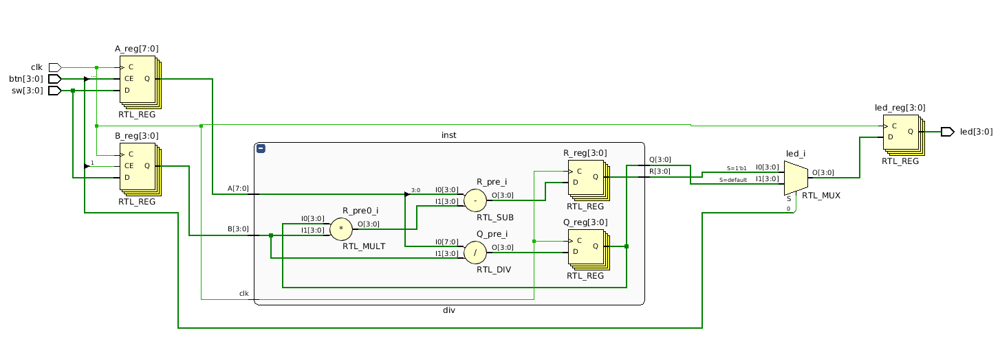

This small sketch demonstrates the division operation on Zybo board.
It was implemented to use only the PL, but no PS nor ARM.
  The usage is simple:
   - on switches 3:0 select the upper four bits of dividend, then press&release button 3
   - on switches 3:0 select the lower four bits of dividend, then press&release button 2
   - on switches 3:0 select the four bits of divisor, then press&release button 1
   - on LEDs 3:0 will be visible the four bits of the quotient
   - if you push the button 0, on the LEDs will appear the four bits of the remainder

   This is the pre-synthesised, elaborated design 
   

Original blog post [freeelectron.ro](https://freeelectron.ro/4bit-division-verilog-example-on-zynq-fpga/)

